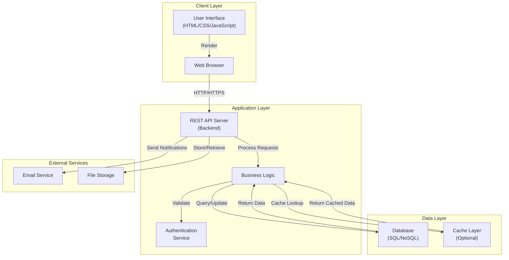

# EquiNode Architecture Overview

This document outlines the architecture of the EquiNode web application, displaying the relationships between the frontend, backend, and database layers.

## System Architecture

## Component Descriptions

### Client Layer
- **User Interface**: HTML markup, CSS styling, and JavaScript for interactive elements
- **Web Browser**: Renders the UI and communicates with the backend API

### Application Layer
- **REST API Server**: Handles HTTP requests from the frontend and returns JSON responses
- **Authentication Service**: Manages user authentication and authorization
- **Business Logic**: Core application logic for processing data and enforcing business rules

### Data Layer
- **Database**: Primary data storage (SQL or NoSQL depending on requirements)
- **Cache Layer**: Optional caching mechanism (Redis, Memcached) for improved performance

### External Services
- **Email Service**: Sends notifications and transactional emails
- **File Storage**: Manages file uploads and storage (cloud storage, local filesystem, etc.)

## Data Flow

1. User interacts with the UI in the browser
2. Browser sends HTTP request to the REST API
3. API receives request and routes to appropriate handler
4. Handler performs authentication validation
5. Business logic processes the request
6. Data is queried/updated in the database
7. Optional cache lookup/update occurs
8. Response is formatted and returned to the browser
9. Browser renders the updated UI

## Key Technologies

- **Frontend**: HTML, CSS, JavaScript (or framework of choice)
- **Backend**: Node.js, Python, Java, or other server-side runtime
- **Database**: PostgreSQL, MongoDB, MySQL, or similar
- **Authentication**: JWT, OAuth 2.0, or session-based authentication
- **Caching**: Redis or Memcached (optional)

## Deployment Considerations

- Frontend can be served from a CDN or web server
- Backend API should be scalable and fault-tolerant
- Database requires proper backup and recovery strategies
- Consider load balancing for high-traffic scenarios
- Implement proper logging and monitoring across all layers
